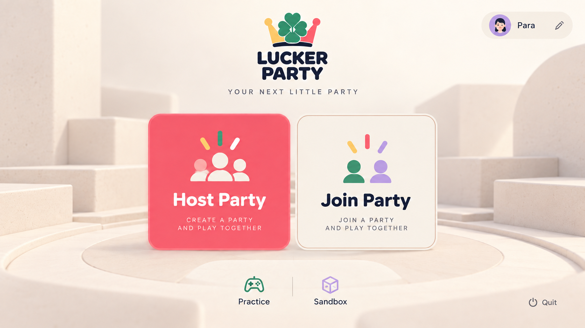
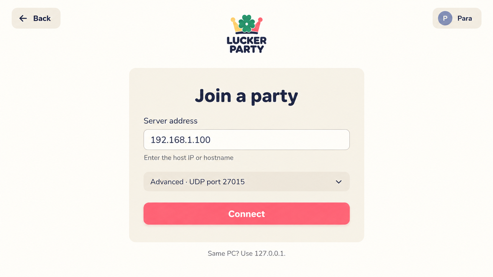
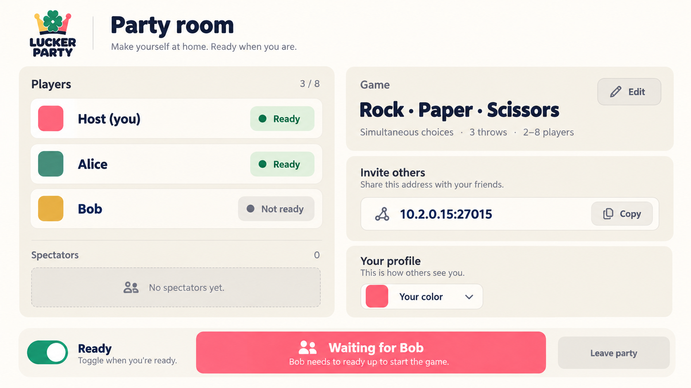
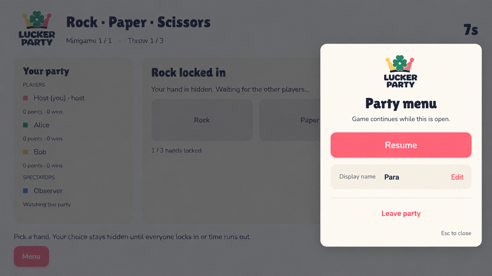

# Party UI concepts — September 29, 2026

These four images are **review mockups**, generated with the built-in imagegen
tool from native Windows captures of Beta 34. Their Home → Join → Lobby → Esc
hierarchy now informs native Godot screens, though the images are not pixel-for-pixel
specifications or production assets. The finalized logo in `assets/brand/` remains canonical;
generated approximations of its shape, new slogans, avatars and decorative
backgrounds are not design decisions.

| Concept | Visual | Design question |
| --- | --- | --- |
| Home |  | Can we make Host/Join the clear first choice and move address fields to Join? |
| Join |  | Can one address field and a tucked-away port cover the common path? |
| Lobby |  | Can readiness, who is blocking Start, invite info and the selected game all be readable at a glance? |
| In-party menu |  | Can Esc expose only Resume, name and Leave while the game stays visible and live behind it? |

The images follow four prompts: **(1)** a branded home with large Host/Join cards
and secondary Practice/Sandbox; **(2)** a Join screen with address, advanced UDP
port and Connect; **(3)** a roster-first lobby with a game card, invite address,
personal Ready toggle and contextual host Start state; **(4)** a small Esc overlay
over the live RPS choice screen, with Resume, name edit and Leave. The existing
Windows screens were used as *style references*, not edit targets. All four were
generated separately to keep typography and layout legible. The home output then
received a targeted edit replacing invented festival scenery with quiet modular
concrete forms while preserving the UI hierarchy.

## Proposed interaction flow

| State | Primary action | Contextual controls and information |
| --- | --- | --- |
| Home | Host Party or Join Party | Edit display name in one compact profile control. Practice and multiplayer Sandbox are quiet secondary options. No address field yet. Host uses UDP 27015 by default; expose a small pre-host network setting for nondefault ports before binding the server. |
| Join step | Connect | Address is required; UDP port defaults to 27015 under Advanced. Back preserves the typed address. A future combined `host:port` paste should match the host's Copy invite action. |
| Party lobby | Ready (each player); Start (host when eligible) | Show roster with each player's ready state, selected game, throw count and invite address. Put own role/color beside own name; only host sees game settings. Explain exactly who is blocking Start. Changing settings resets readiness, with visible feedback. Spectators can join players here. |
| Countdown and instructions | Read objective | Show next game, rules and timer. No misleading Play/Skip control. Tab standings and Esc menu remain available. |
| RPS choice | Choose one hand | Show throw number, deadline and current submitted count. Once submitted, show the locked hand and waiting state; spectators see a spectator view. |
| Reveal and results | Read outcome | Show hands, wins, points and the next phase's countdown. Only final results need an action. |
| Final results | Play again (host) | Everyone sees champion(s) and standings. Guests see “Waiting for host”; replay returns everyone to the same lobby, unready. |
| Esc menu | Resume | Rename is collapsed until Edit. Leave requires a second step when the listen host would close everyone's party. The game continues behind the overlay. |

Alt-Tab should preserve whichever screen the player was using, including a
manually opened menu. The party never pauses. In the first-person sandbox,
unfocused windows release local input and the mouse but keep simulation and the
connection active; focus restores input unless the player explicitly opened
the menu.

## What to keep and what to revise

- **Keep:** the home concept's clear Host/Join split; the Join concept's
  progressive disclosure; the lobby's large ready badges and obvious blocker;
  the Esc overlay's small set of actions and visible live game underneath.
- **Revise:** the home background is exploratory, not a new game world. Its
  profile avatar, button symbols and logo drawing are generated approximations;
  use a name/color chip rather than inventing a persistent character, and use
  the canonical SVG and intentional art assets in code. The plain “Sandbox”
  label should say that it hosts a multiplayer sandbox until an offline
  sandbox entry exists.
- **Revise:** the lobby image colors “Waiting for Bob” like an enabled action.
  That state should have a disabled Start face or a separate neutral status,
  paired with the reason. Its address Copy action implies an `IP:port` paste flow
  that the current game does not accept yet.
- **Revise:** the Esc image repeats the logo. One small brand mark is enough;
  prioritize current game context and clear Resume/Leave hierarchy.

The implemented flow lives in `GameRootMenu.cs`, `PartyView.cs`,
`PartyShell.tscn`, and `PartyUiStyle.cs`. Further visual polish can build on
native controls without turning image pixels into the UI implementation.
